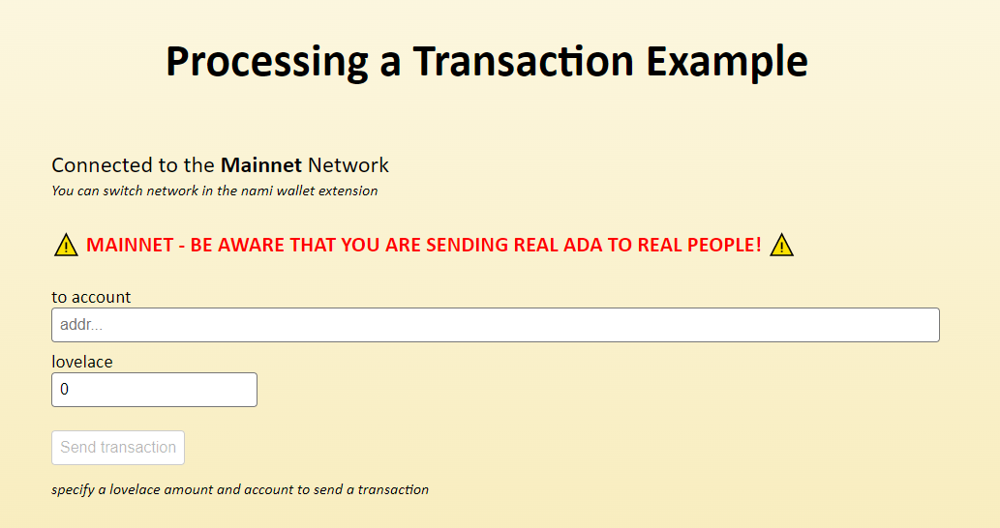
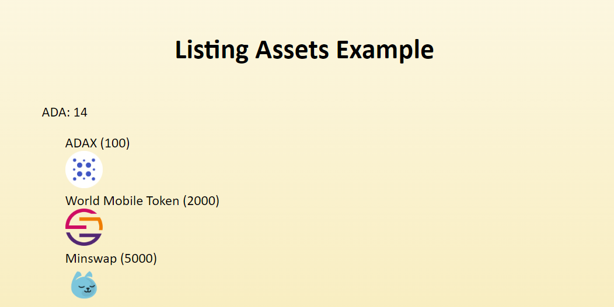

# Lucid Blockfrost Proxy Example

## DISCLAIMER

Always be careful when interacting with the blockchain. Misuse can result in a loss of funds. This is only a technical example, and should be treated as such, I don't take any responsibility for any damage it might cause.

## use-cardano, use-cardano-blockfrost-proxy, and Cardano Starter Kit

This repository is a simplified example of how to proxy blockfrost requests, and does good to serve as a reference. If you are looking for a complete solution of integration lucid and blockfrost in a React or Next.js project, you should check out [use-cardano](https://www.github.com/use-cardano/use-cardano) with [use-cardano-blockfrost-proxy](https://www.github.com/use-cardano/use-cardano-blockfrost-proxy). If you want a ready-to-use Next.js starter kit, have a look at [Cardano Starter Kit](https://cardano-starter-kit.alangaming.com).

## Examples

### Processing a transaction

### Listing assets

## Explanation

This is an example repo for using a proxy for the Lucid Blockfrost provider, so that the Project Id is not leaked to the client, as discussed in [this github issue](https://github.com/spacebudz/lucid/issues/25).

The example itself allows you to send a transaction over either testnet or mainnet.

This repo uses `next.js` and React. The code itself is also quite React-ish, building mainly on custom hooks. I don't necessarily suggest building your code like this, but since I have to deal with network changes, this was a suitable pattern.

## Structure

This is a standard next.js project, with only one page; `pages/index.tsx`. All the important code is located in the `hooks` folder.

## Features

- Forwards all blockfrost requests via the `pages/api/[[...all]].ts` routes, making it possible to hide your blockfrost keys
- The keys are injected via env variables (see the `.env.template` file)
- Handles both `mainnet` and `testnet`
- Listens to network changes using the `experiments` api that - in this case - nami injects

## Limitations / Considerations

Since the Lucid package doesn't seamlessly support network changes, I had to keep track of it in states. Not sure I like this pattern, but it is what it is. Not sure if there are any implications to doing it this way.

The proxy API might not be 100% compatible with the blockfrost API. IE. if there are any unforeseen issues, the API will return an empty 400 response, which the Lucid Blockfrost provider might be incompatible with. I will research this more. Improvements are welcome.

## Contributing

Just send an issue and/or PR my way if you have improvement suggestions. Much welcome.

# License

MIT, see LICENSE file.
